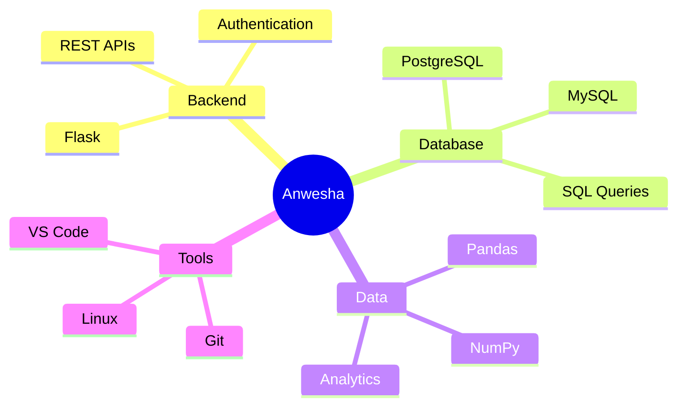
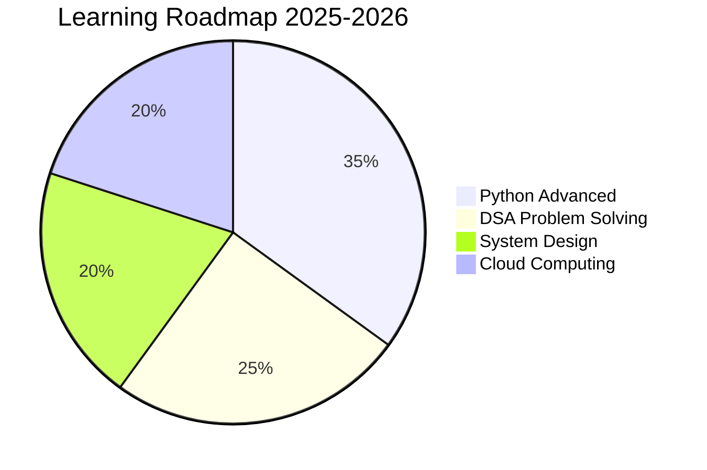

 

<div align="center">
 
<h1 align="center">Hi 👋, I'm Anwesha Mishra</h1>


<p align="left"> 
   
  
  
</p>
  
  
  <br>
  
  
  
  <br>
  

</div>

---

## 👩‍💻 **ABOUT ME**

```
┌─────────────────────────────────────────────────────────────────┐
│                         ANWESHA MISHRA                          │
├─────────────────────────────────────────────────────────────────┤
│  👤 Role          │  Aspiring Backend Developer                 │
│  🔧 Skills       │  Python, NumPy, Pandas, Flask, API, PostgreSQL, HTML, CSS, DSA │
│  🎯 Focus        │  Backend Development & Data Engineering      │
│  ❤️ Interests    │  Open Source, Solving small problems         │
│  🏆 Goal         │  Build impactful applications & collaborate  │
│  📝 Mantra       │  "Code. Learn. Improve. Repeat. 🚀"         │
└─────────────────────────────────────────────────────────────────┘
```

---

## 🛠️ **TECH STACK**

<p align="center">
  
</p>

<p align="center">
  
  
  
  
  
  
  
</p>

---

## 📊 **GITHUB STATS**

<p align="center">
  
  
</p>

<p align="center">
  
</p>

---

## 📈 **ACTIVITY METRICS**

<p align="center">
  ⭐ Total Stars: 2<br>
  📅 Total Commits (2025): 30<br>
  📄 Total PRs: 0<br>
  🐛 Total Issues: 0<br>
  ✔️ Contributed to (last year): 0<br>
</p>
---
## 🧠 **SKILLS MINDSET**



## 🎯 **CURRENT FOCUS**



## 📈 Contribution Graph

<p align="center">
  
</p>
<p align="center">
  
  
</p>

<p align="center">
  
</p>
<p>

## 🚀 **CURRENT FOCUS**

- 🔭 Working on **Exciting Projects**
- 🌱 Learning **Python, NumPy, Pandas, Flask, API, PostgreSQL, HTML, CSS, DSA, and Open Source**
- 👯 Looking to collaborate on **Open Source Projects**
- 🤝 Open to collaborate on **Backend & Data Engineering**
- 💬 Ask me about **Python, Flask, Pandas, SQL, DSA**

---
## 📊 **WEEKLY CODING STATS**

```text
Monday      ███████████░░░░░░░░░░░░░░   45%
Tuesday     ██████████░░░░░░░░░░░░░░░   42%
Wednesday   ████████████░░░░░░░░░░░░░   48%
Thursday    ██████████░░░░░░░░░░░░░░░   42%
Friday      █████████░░░░░░░░░░░░░░░░   38%
Saturday    ████████████░░░░░░░░░░░░░   48%
Sunday      ██████████████░░░░░░░░░░░   55%
```

---


---

## 🌐 **CONNECT WITH ME**

<p align="center">
  <a href="mailto:mishra.anwesha143@gmail.com"></a>
  <a href="https://www.linkedin.com/in/anwesha-mishra-3a0204359/"></a>
  <a href="https://github.com/Anwesha-mishra-9090"></a>
  <a href="https://www.hackerrank.com/@mishra_anwesha11"></a>
  <a href="https://www.leetcode.com/anweshamishra123"></a>
  <a href="https://stackoverflow.com/users/30472215"></a>
  <a href="https://auth.geeksforgeeks.org/@anwesharicvt61/profile"></a>
</p>

---
---

## 🚀 **FEATURED PROJECTS**

| 🏆 Project | 📝 Description | 🔧 Tech Stack | 🔗 Links |
|------------|----------------|---------------|----------|
| **IT Service Desk with SLA Analytics** | Production-ready platform with automated SLA monitoring & real-time analytics | Flask, PostgreSQL, Chart.js, Bootstrap | [📁 Repo](https://github.com/Anwesha-mishra-9090/it-service-desk-sla-analytics) • [🌐 Live](https://it-service-desk-sla-analytics.onrender.com) |


## 🐍 **SNAKE ANIMATION**

<picture>
  <source media="(prefers-color-scheme: dark)" srcset="https://raw.githubusercontent.com/platane/platane/output/github-contribution-grid-snake-dark.svg">
  <source media="(prefers-color-scheme: light)" srcset="https://raw.githubusercontent.com/platane/platane/output/github-contribution-grid-snake.svg">
  
</picture>

---

<div align="center">

  
  
  ### 💡 *"I enjoy solving small problems and watching my code work!"*
  
  ### ⭐ **Thanks for visiting!** ⭐
  
  ---
  
  **💻 Made with ❤️ by Anwesha Mishra**
  
</div>

