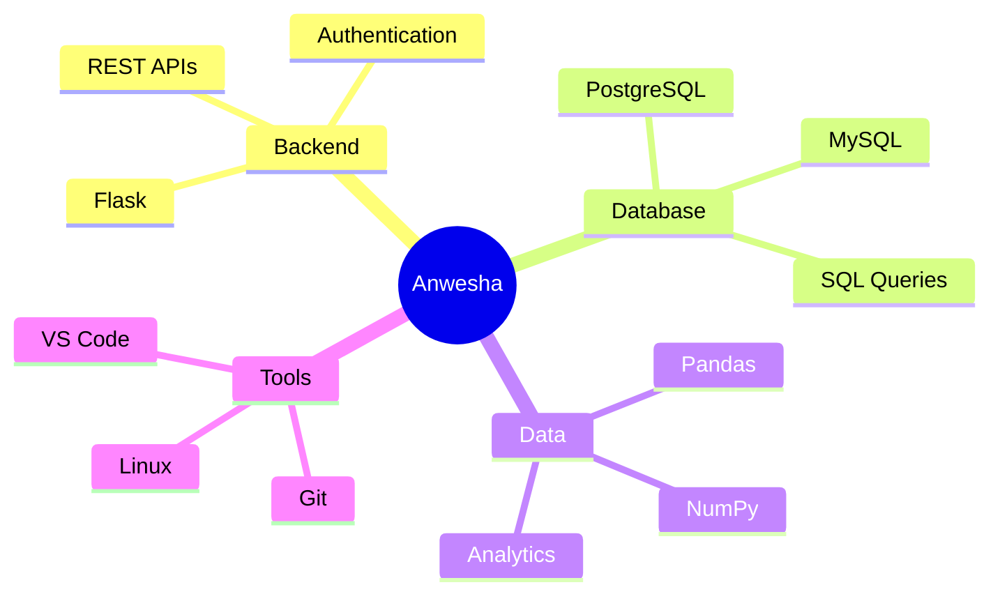
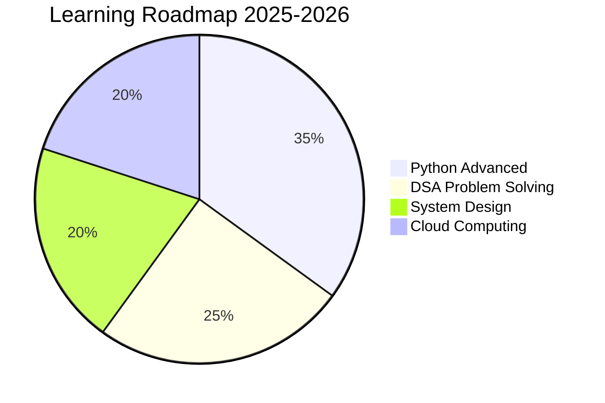

<div align="center">
  
  
  
  
  
  <br>
  
  <!-- Animated GIF -->
  
  
</div>

<br>

<!-- Profile Views and Badges -->
<p align="center">
  
  
  
  
</p>

---

## 🎯 **ABOUT ME**

<table width="100%">
<tr>
<td width="60%">

### ✨ **Who Am I?**

```python
class AnweshaMishra:
    def __init__(self):
        self.role = "Aspiring Software Engineer"
        self.focus = ["Backend Development", "Data Engineering"]
        self.skills = ["Python", "SQL", "Flask", "PostgreSQL"]
        self.currently = "Building Production-Ready Applications"
        self.goal = "Make an impact through clean, efficient code"
    
    def say_hi(self):
        return f"Turning coffee into code ☕ → 💻"
    
    def dream(self):
        return "Join a team where I can grow and contribute!"
```

</td>
<td align="center" width="40%">


</td>
</tr>
</table>

---

## 📊 **SKILLS & TECHNOLOGIES**

### 🚀 **Tech Stack Mastery**

<p align="center">
  
</p>

### 📈 **Proficiency Levels**

<p align="center">
  
  
  
  
  
</p>

---

## 🏆 **GITHUB STATISTICS**

<p align="center">
  
</p>

<p align="center">
  
  
</p>

<p align="center">
  
  
</p>

---

## 📈 **ACTIVITY & CONTRIBUTIONS**

<p align="center">
  
</p>

<!-- Snake Animation -->
<picture>
  <source media="(prefers-color-scheme: dark)" srcset="https://raw.githubusercontent.com/platane/platane/output/github-contribution-grid-snake-dark.svg">
  <source media="(prefers-color-scheme: light)" srcset="https://raw.githubusercontent.com/platane/platane/output/github-contribution-grid-snake.svg">
  
</picture>

---

## 🚀 **FEATURED PROJECTS**

<div align="center">
  
| 🏆 Project | 📝 Description | 🔧 Tech Stack | 🔗 Links |
|------------|----------------|---------------|----------|
| **IT Service Desk with SLA Analytics** | Production-ready platform with automated SLA monitoring & real-time analytics | Flask, PostgreSQL, Chart.js, Bootstrap | [](https://github.com/Anwesha-mishra-9090/it-service-desk-sla-analytics) [](https://it-service-desk-sla-analytics.onrender.com) |

</div>

---

## 🌐 **CONNECT WITH ME**

<p align="center">
  <a href="https://github.com/anwesha-mishra-9090"></a>
  <a href="https://www.linkedin.com/in/anwesha-mishra-3a0204359/"></a>
  <a href="https://www.hackerrank.com/@mishra_anwesha11"></a>
  <a href="https://www.leetcode.com/anweshamishra123"></a>
  <a href="https://stackoverflow.com/users/30472215"></a>
  <a href="https://auth.geeksforgeeks.org/@anwesharicvt61/profile"></a>
</p>

---

## 📧 **CONTACT ME**

<p align="center">
  <a href="mailto:mishra.anwesha143@gmail.com">
    
  </a>
</p>

---

## 📊 **WEEKLY CODING STATS**

<!--START_SECTION:waka-->

```text
Monday      ███████████░░░░░░░░░░░░░░   45%
Tuesday     ██████████░░░░░░░░░░░░░░░   42%
Wednesday   ████████████░░░░░░░░░░░░░   48%
Thursday    ██████████░░░░░░░░░░░░░░░   42%
Friday      █████████░░░░░░░░░░░░░░░░   38%
Saturday    ████████████░░░░░░░░░░░░░   48%
Sunday      ██████████████░░░░░░░░░░░   55%
```

<!--END_SECTION:waka-->

---

## 🎯 **CURRENT FOCUS**



---

## 📍 **VISITOR MAP**

<p align="center">
  
</p>

<p align="center">
  
</p>

---

## 💬 **QUOTE OF THE DAY**

<div align="center">
  
  
  
</div>

---

<div align="center">
  
  
  
  ### 💡 *"The only way to do great work is to love what you do."*
  
  ### ⭐ **Thanks for visiting! Star my repos if you find them useful!** ⭐
  
  ---
  
  **💻 Made with ❤️ and 🐍 Python by Anwesha Mishra**
  
</div>
```

